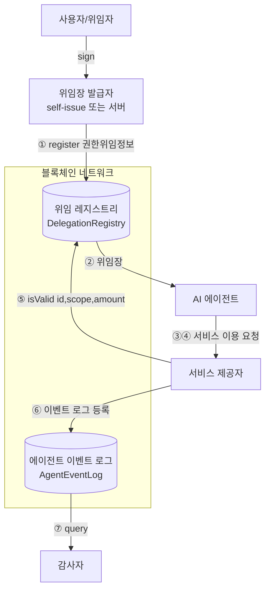
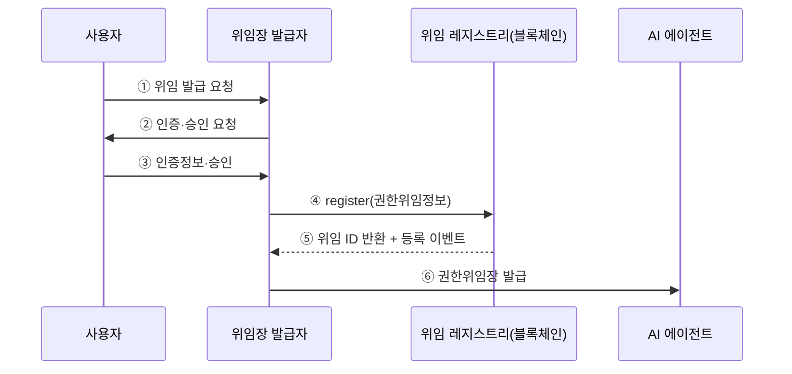
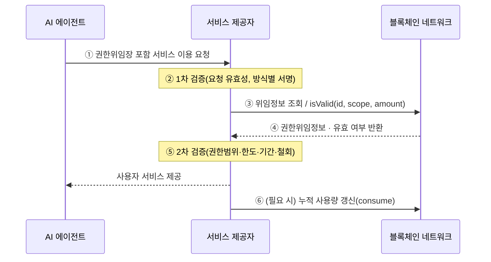
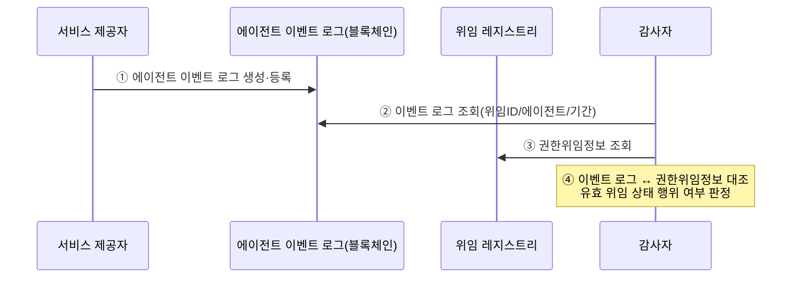

정보통신단체표준(국문표준)

TTAK.KO-XX.XXXX (과제번호 부여 예정)        제정일 202X.XX.XX.

---

# 블록체인 기반 AI 에이전트 권한위임 및 검증 프로토콜

## Blockchain-based Authority Delegation and Verification Protocol for AI Agents

| 구분 | 내용 |
|---|---|
| 표준초안 검토 위원회 | 블록체인기반기술 프로젝트그룹(PG1006) *(대안: PG502)* |
| 표준안 심의 위원회 | 지능정보기반 기술위원회(TC10) *(대안: 정보보호 TC5)* |
| 표준(과제) 제안 | ㈜씨피랩스 (송주한, 정종식) |
| 표준 초안 에디터 | 정종식 (㈜씨피랩스) |
| 협력 | 유순덕 (한세대학교) — 상위 거버넌스 프레임 연계 |

> 본 표준에 대한 저작권은 TTA에 있으며, TTA와 사전 협의 없이 이 문서의 전체 또는 일부를 상업적 목적으로 복제 또는 배포해서는 안 됩니다.
> 본 표준 발간 이전에 접수된 지식재산권 확약서 정보는 본 표준의 '부록(지식재산권 확약서 정보)'에 명시한다. (등록특허 10-2025-0074709)

---

## 목 차

```
1 적용 범위
2 인용 표준
3 용어 정의
4 약어
5 블록체인 기반 AI 에이전트 권한위임 프로토콜 구조
    5.1 위임 등록 모듈
    5.2 위임장 발급 모듈
        5.2.1 검증 가능한 위임 자격증명(VC) 방식
        5.2.2 스마트 컨트랙트 방식
        5.2.3 위임 토큰 방식
        5.2.4 일회용키 방식
    5.3 위임장 데이터 모델
    5.4 검증 모듈
    5.5 감사 모듈
6 프로토콜 적용 시나리오
    6.1 권한위임 등록 시나리오
    6.2 에이전트 서비스 요청 및 검증 시나리오
    6.3 위임 이행 감사 시나리오
7 보안 위협 및 보안 요구사항
    7.1 보안 위협
    7.2 보안 요구사항
부록 I-1 지식재산권 확약서 정보
     I-2 시험인증 관련 사항
     I-3 본 표준의 연계(family) 표준
     I-4 참고 문헌
     I-5 표준의 이력
```

---

## 1 적용 범위

이 표준은 사용자가 AI 에이전트에게 특정 권한을 위임하여 서비스를 대리 수행하도록 할 때, 위임의 **등록·발급·검증·감사**를 블록체인 기반으로 안전하게 수행하기 위한 프로토콜의 구조와 적용 시나리오를 규정한다.

사용자(위임자)와 AI 에이전트, 위임장 발급자, 서비스 제공자, 감사자 간의 상호작용을 정의하고, 권한위임정보를 블록체인 네트워크에 등록한 상태에서 서비스 제공자가 검증 시점에 블록체인을 참조하여 위임의 유효성을 확인하는 절차를 제공한다.

이를 통해 ▲에이전트의 권한 초과 행위 방지 ▲위임 범위의 투명성·무결성 보장 ▲위임 이행 내역의 변조 불가능한 감사를 달성하여, 자율적 AI 에이전트의 신뢰 가능한 대규모 상용화 기반을 마련하는 데 목적이 있다.

**적용 대상**: 본 표준은 사용자를 대신해 외부 서비스에 접근·거래하는 AI 에이전트를 운용하는 서비스 제공자, 위임장을 발급·관리하는 발급자, 위임 이행을 감사하는 감사 주체에 적용된다. 특정 블록체인 플랫폼·합의 알고리즘에 종속되지 않으며, 권한위임정보를 등록·조회할 수 있는 분산원장과 DID 레지스트리를 전제로 한다.

**적용 제외**: 에이전트의 내부 추론 과정, 실행 샌드박스, 에이전트-에이전트(A2A) 오케스트레이션 프로토콜 자체는 본 표준의 범위에 포함하지 않는다. 본 표준은 *사용자→에이전트 권한위임의 등록·검증·감사*에 한정한다.

## 2 인용 표준

다음 문서는 본 표준의 적용에 필수적인 인용 표준이다. 발행 연도가 표기된 인용 표준은 인용된 판(추록 포함)만 적용하며, 발행 연도가 표기되지 않은 인용 표준은 최신판을 적용한다.

- **[1]** W3C Recommendation, *Decentralized Identifiers (DIDs) v1.0*, 2022-07-19.
- **[2]** W3C Recommendation, *Verifiable Credentials Data Model v2.0*, 2025-05-15.

> **에디터 노트 — 인용 표준 확정(v0.2 → v0.3)**
> - 본 표준은 DID 레지스트리 기반 퍼블릭키 해석(5.2·5.4)에 **[1]**을, 검증 가능한 위임 자격증명(VC) 방식(5.2.1)에 **[2]**를 규범적으로 의존한다. 두 문서는 모두 W3C 정식 권고안(Recommendation)으로 안정 단계이다.
> - **DID v1.1**은 2026-03-05 후보권고안(Candidate Recommendation) 단계이다(미디어 타입 `application/did` 일원화, DID Resolution v0.3 분리 등). 정식 권고안 확정 시 [1]을 갱신한다 → 진행 상황은 부록 I-4(참고).
> - ERC-1484(EIN)/ERC-1056, OIDF *Identity Management for Agentic AI*(2025-10), DIF *MCP-I*(2026-03)는 본 표준이 특정 식별자 체계·프레임워크에 종속되지 않으므로 **규범적 인용에서 제외**하고 참고 문헌(부록 I-4)에 둔다. ERC-1484 EIN은 DID 외 식별자의 *예시*로만 언급된다(5.3).
> - 서명 알고리즘 및 시각 표현 형식(예: ISO 8601 / RFC 3339)은 현재 본문에서 특정하지 않으므로 인용 표준에 포함하지 않는다. 상호운용을 위해 유효기간 필드의 시각 표현을 규범화할지는 v0.3에서 결정한다(미결정).

## 3 용어 정의

- **3.1 AI 에이전트(AI Agent)**: 사용자로부터 권한을 위임받아 사용자 서비스를 대리 수행하는 자율적 소프트웨어 주체.
- **3.2 위임자(Delegator)**: AI 에이전트에게 권한을 위임하는 사용자.
- **3.3 위임장 발급자(Delegation Issuer)**: 권한위임정보에 대응하는 권한위임장을 발급하는 주체. 사용자 자체 서명 또는 발급자 서버일 수 있다.
- **3.4 권한위임정보(Delegation Information)**: 사용자가 AI 에이전트에게 위임한 권한의 내용으로, 블록체인 네트워크에 등록된다.
- **3.5 권한위임장(Delegation Credential)**: 위임장 발급자가 발급하는 위임 증표. 검증 가능한 위임 자격증명(VC), 스마트 컨트랙트 어드레스, 위임 토큰, 일회용키 중 하나의 형태를 가진다.
- **3.6 위임 레지스트리(Delegation Registry)**: 권한위임정보를 저장·조회하는 블록체인 상의 등록부.
- **3.7 감사자(Auditor)**: 블록체인에 등록된 권한위임정보와 에이전트 이벤트 로그를 참조하여 에이전트가 유효한 위임 상태에서 행위하였는지 감사하는 주체.
- **3.8 서비스 제공자(Service Provider)**: AI 에이전트의 서비스 이용 요청을 수신하여 요청 유효성과 위임 유효성을 검증한 후 사용자 서비스를 제공하는 주체.
- **3.9 권한범위(Scope)**: 에이전트가 권한위임장으로 수행할 수 있는 행위의 집합. 복수 권한의 조합으로 표현될 수 있다.
- **3.10 위임 검증(Delegation Verification)**: 서비스 제공자가 권한위임장과 블록체인의 권한위임정보를 참조하여, 요청이 권한범위·한도·유효기간·철회 여부에 부합하는지 확인하는 절차.
- **3.11 에이전트 이벤트 로그(Agent Event Log)**: 에이전트의 행위 이력을 위임 ID와 함께 블록체인에 기록한 변조 불가능한 로그.
- **3.12 철회(Revocation)**: 위임자가 발급된 권한위임장의 효력을 유효기간 이전에 무효화하는 행위.
- **3.13 노드(Node)**: 분산원장의 복제본을 저장하고 분산원장 네트워크에 참여하는 장치 또는 프로세스.

## 4 약어

- A2A — Agent to Agent
- DID — Decentralized Identifier
- DLT — Distributed Ledger Technology
- EIN — Ethereum Identity Number (ERC-1484)
- IPR — Intellectual Property Rights
- TLS — Transport Layer Security
- VC — Verifiable Credential

## 5 블록체인 기반 AI 에이전트 권한위임 프로토콜 구조

### 5.0 구조 개요

본 프로토콜은 **위임 관리부**(위임 등록·위임장 발급·검증·감사)와 **위임 블록체인부**(권한위임정보·에이전트 이벤트 로그 저장)로 구성된다. 위임 관리부의 각 모듈은 위임 블록체인부의 등록부(위임 레지스트리)와 로그(에이전트 이벤트 로그)에 대해 등록·조회 연산을 수행한다.

프로토콜에 참여하는 주체는 다음과 같다.

| 주체 | 역할 |
|---|---|
| 위임자(사용자) | AI 에이전트에게 권한을 위임하고, 위임을 철회할 수 있다. |
| 위임장 발급자 | 권한위임정보에 대응하는 권한위임장을 발급한다. 사용자 자체 서명(self-issue) 또는 발급자 서버 형태가 가능하다. |
| AI 에이전트 | 권한위임장을 획득하여 위임 범위 내에서 사용자 서비스를 대리 요청한다. |
| 서비스 제공자 | 서비스 이용 요청의 유효성과 권한위임장의 유효성을 검증한 후 서비스를 제공한다. |
| 감사자 | 권한위임정보와 에이전트 이벤트 로그를 대조하여 유효 위임 상태 여부를 감사한다. |
| 블록체인 네트워크 | 위임 레지스트리와 에이전트 이벤트 로그를 저장하는 분산원장. |
| DID 레지스트리 | 사용자·에이전트의 DID에 대응하는 퍼블릭키를 제공한다. |

주체 간 오프체인 통신은 TLS를 적용한다.



**그림 1 — 블록체인 기반 AI 에이전트 권한위임 프로토콜 구조**

### 5.1 위임 등록 모듈

위임 등록 모듈은 사용자 인증 및 권한위임 승인 절차를 거쳐, 사용자의 권한이 AI 에이전트로 위임되었음을 증명하는 권한위임정보를 블록체인 네트워크의 위임 레지스트리에 등록한다. (청구항 1/13, 6/18)

권한위임정보 등록 시 다음 항목이 결정된다.
- **위임 ID(delegationId)**: 사용자·에이전트·논스(nonce)의 해시로 산출되는 고유 식별자.
- **권한범위(scope)**: 에이전트가 수행 가능한 행위의 집합. 비트마스크로 표현하여 복수 권한의 조합을 지원한다(예: 거래/팔로우/전송/출금).
- **한도(maxAmount, totalCap)**: 1회 요청 상한 및 누적 상한. 누적 상한 0은 무제한을 의미한다.
- **유효기간(validFrom, validUntil)**: 위임의 효력 발생·만료 시점.
- **철회 URL(revocationURL)·추적 URL(trackingURL)**: 위임장 데이터 모델(5.3)의 필수 참조 항목.

등록이 완료되면 등록 이벤트(DelegationRegistered)가 발생하며, 이후 위임장 발급(5.2)으로 이어진다.

### 5.2 위임장 발급 모듈

위임장 발급자는 등록된 권한위임정보에 대응하는 권한위임장을 다음 네 가지 방식 중 하나로 AI 에이전트에게 발급한다. 위임장의 형태는 검증 방식(5.4)을 결정한다.

#### 5.2.1 검증 가능한 위임 자격증명(VC) 방식
사용자 DID로 서명한 검증 가능한 위임 자격증명(VC)을 위임장으로 발급한다. 서비스 제공자는 사용자 DID에 대응하는 퍼블릭키를 DID 레지스트리에서 획득하여 VC의 사용자 서명값을 검증한다. (청구항 4–5/16–17)

#### 5.2.2 스마트 컨트랙트 방식
권한위임정보를 포함한 스마트 컨트랙트(위임 레지스트리)에 위임을 등록하고, 해당 위임을 식별하는 컨트랙트 어드레스 및 위임 ID를 위임장으로 발급한다. 검증은 스마트 컨트랙트가 직접 수행한다(5.4 참조). (청구항 6–7/18–19)

> 본 방식은 reference implementation(meta-agents v0.3.0)에서 구현·배포 완료되었다. 위임 레지스트리는 `register()`, `isValid()`, `revoke()`, `consume()`, `getDelegation()` 연산을 제공한다.

#### 5.2.3 위임 토큰 방식
사용자 서명값을 포함한 위임 토큰을 위임장으로 발급한다. 서비스 제공자는 사용자 퍼블릭키로 토큰의 사용자 서명값을 검증한 후, 블록체인 네트워크에서 권한위임정보를 조회하여 요청의 유효성을 확인한다. (청구항 8–9/20–21)

#### 5.2.4 일회용키 방식
일회용키의 임시 프라이빗키를 위임장으로 발급한다. AI 에이전트는 임시 프라이빗키로 서비스 이용 요청에 서명하고, 서비스 제공자는 DID 레지스트리에서 획득한 임시 퍼블릭키로 에이전트 서명값을 검증한다. 일회용 특성으로 재사용 공격을 방지한다. (청구항 10–11/22–23)

### 5.3 위임장 데이터 모델

권한위임장 및 그에 대응하는 권한위임정보는 다음 요소를 포함한다. (청구항 12/24)

| 필드 | 설명 |
|---|---|
| 사용자 DID | 위임자의 분산 식별자 |
| 에이전트 DID | 수임 AI 에이전트의 분산 식별자 |
| 사용자 ID / 에이전트 ID | DID 외 식별자(예: ERC-1484 EIN 등) |
| 위임 ID | 위임의 고유 식별자 |
| 철회 URL | 사용자가 위임을 철회할 수 있는 참조 주소 |
| 추적용 URL | 위임 사용 내역을 확인하는 참조 주소 |
| 유효기간 | 위임의 효력 발생·만료 시점 |
| 수행 가능 권한범위 | 에이전트가 위임장으로 수행할 수 있는 행위의 집합 |

### 5.4 검증 모듈

서비스 제공자는 AI 에이전트의 서비스 이용 요청에 대해 2단계 검증을 수행한다.

1. **1차 검증(요청 유효성)**: 서비스 이용 요청 정보 자체의 형식·서명 유효성을 검증한다. 위임장 방식별로 다음 분기를 따른다.
   - VC 방식: 사용자 DID 퍼블릭키로 VC의 사용자 서명값 검증
   - 스마트 컨트랙트 방식: 컨트랙트 어드레스로 위임 레지스트리에 검증 요청
   - 위임 토큰 방식: 사용자 퍼블릭키로 토큰의 사용자 서명값 검증
   - 일회용키 방식: 임시 퍼블릭키로 에이전트 서명값 검증
2. **2차 검증(위임 유효성)**: 권한위임장을 참조하여 블록체인 네트워크로부터 권한위임정보를 획득하고, 요청이 권한범위·한도·유효기간·철회 여부에 부합하는지 확인한다. 스마트 컨트랙트 방식의 경우 `isValid(위임ID, 요구권한, 요청금액)`이 유효 여부와 사유를 반환한다.

두 검증을 모두 통과한 경우에만 사용자 서비스를 제공한다. 한도 추적이 필요한 경우 서비스 제공자는 누적 사용량 갱신(consume) 연산을 호출한다.

### 5.5 감사 모듈

AI 에이전트의 서비스 이행 시, 서비스 제공자는 에이전트 이벤트 로그를 생성하여 블록체인 네트워크에 등록한다. (청구항 2/14)

에이전트 이벤트 로그는 다음을 포함한다: 위임 ID, 에이전트 식별자, 행위 유형(actionType), 행위 페이로드의 해시(actionHash — 원문 비노출), 서비스 제공자 식별자, 타임스탬프, 블록 번호.

감사자는 위임 ID 또는 에이전트 식별자, 기간으로 이벤트 로그를 조회하고, 블록체인에 등록된 권한위임정보와 대조하여 에이전트가 **유효한 위임 상태에서 행위하였는지**를 감사한다. (청구항 3/15)

> 대규모 환경에서는 원문 이벤트를 오프체인에 저장하고 주기적으로 머클 루트(Merkle root)만 온체인에 앵커링하여 "블록체인 네트워크에 등록" 요건을 충족하면서 비용을 절감할 수 있다.

## 6 프로토콜 적용 시나리오

### 6.1 권한위임 등록 시나리오



**그림 2 — 권한위임 등록 시퀀스**

1. 사용자가 특정 AI 에이전트에 대한 권한위임장 발급을 요청한다(권한범위·한도·유효기간 지정).
2. 위임장 발급자가 사용자에게 인증 정보와 권한위임 승인을 요청한다.
3. 사용자가 인증 정보와 승인 정보를 제출한다.
4. 위임장 발급자가 권한위임정보를 위임 레지스트리(블록체인)에 등록한다.
5. 위임 레지스트리가 위임 ID를 반환하고 등록 이벤트를 발생시킨다.
6. 위임장 발급자가 5.2의 방식 중 하나로 권한위임장을 발급하고, AI 에이전트가 이를 획득한다.

### 6.2 에이전트 서비스 요청 및 검증 시나리오



**그림 3 — 에이전트 서비스 요청 및 검증 시퀀스**

1. AI 에이전트가 권한위임장을 포함하여 서비스 이용 요청 정보를 서비스 제공자에게 전송한다.
2. 서비스 제공자가 요청 정보의 유효성을 1차 검증한다(방식별 서명 검증, 5.4 참조).
3~4. 서비스 제공자가 권한위임장을 참조하여 블록체인 네트워크에서 권한위임정보를 조회하고 유효 여부를 확인한다.
5. 권한범위·한도·유효기간·철회 여부를 모두 통과하면 사용자 서비스를 제공한다.
6. 한도 추적이 필요한 경우 누적 사용량을 갱신한다.

### 6.3 위임 이행 감사 시나리오



**그림 4 — 위임 이행 감사 시퀀스**

1. 서비스 이행 시 서비스 제공자가 에이전트 이벤트 로그를 생성하여 블록체인에 등록한다.
2. 감사자가 위임 ID, 에이전트 식별자 또는 기간으로 이벤트 로그를 조회한다.
3. 감사자가 동일 위임 ID의 권한위임정보를 조회한다.
4. 감사자가 양자를 대조하여, 에이전트의 모든 행위가 유효한 위임 범위·기간·한도 내에서 이루어졌는지 판정한다. 위반 시 위반 항목을 식별한다.

## 7 보안 위협 및 보안 요구사항

본 장은 권한위임 프로토콜 운용 시 발생 가능한 보안 위협을 식별하고, 각 위협에 대응하는 보안 요구사항을 규정한다.

### 7.1 보안 위협

| ID | 위협 | 설명 |
|---|---|---|
| T1 | 권한위임장 도용 | 공격자가 탈취한 권한위임장으로 정당한 에이전트를 가장하여 서비스를 요청. |
| T2 | 재사용 공격(Replay) | 가로챈 서비스 이용 요청·위임 토큰을 재전송하여 권한을 반복 행사. |
| T3 | 권한범위 초과 행위 | 에이전트가 위임된 권한범위·한도·기간을 벗어난 행위를 시도. |
| T4 | 위임정보·이벤트 로그 변조 | 등록된 권한위임정보 또는 행위 이력을 사후 위·변조하여 감사 회피. |
| T5 | 위임장 발급자/위임자 신원 위조 | 정당한 위임자의 승인 없이 위임정보를 등록하거나 발급자를 가장. |
| T6 | 철회 미반영 | 철회된 위임장을 서비스 제공자가 인지하지 못하고 계속 수용. |
| T7 | 에이전트 키 탈취·장기 노출 | 신뢰할 수 없는 실행 환경에서 동작하는 에이전트의 서명 키가 탈취될 경우, 장기·광범위 키일수록 피해(blast radius)가 확대. |
| T8 | 사용자 키 노출(신원 도용) | 에이전트가 사용자(위임자)의 개인키를 직접 보유·사용하여 위임이 아닌 신원 도용(impersonation)으로 동작. |

### 7.2 보안 요구사항

| ID | 요구사항 | 대응 위협 |
|---|---|---|
| R1 | 위임정보·에이전트 이벤트 로그는 블록체인에 등록하여 **변조 불가능성**을 보장하여야 한다. | T4 |
| R2 | 서비스 제공자는 위임장 방식별(VC/스마트 컨트랙트/토큰/일회용키)로 **서명 검증을 의무 수행**하여야 한다. | T1, T5 |
| R3 | 위임장에는 **유효기간**을 두고, 일회용키·논스(nonce) 등으로 **재사용을 방지**하여야 한다. | T1, T2 |
| R4 | 서비스 제공자는 검증 시점에 블록체인의 권한위임정보를 참조하여 **권한범위·한도를 강제**하여야 한다. | T3 |
| R5 | 위임장은 **철회 URL**을 포함하고, 검증 시 **철회 여부를 확인**하여야 한다. | T6 |
| R6 | 위임정보 등록은 **위임자의 인증·승인 절차**를 거쳐야 한다. | T5 |
| R7 | 주체 간 오프체인 통신은 **TLS**로 보호하여야 한다. | T1, T2 |
| R8 | 에이전트의 **지속형 식별 키와 단명형 서명 키를 분리**하여야 한다(7.3 참조). 서비스 요청 서명에는 위임에 바인딩된 단명 키를 사용한다. | T7 |
| R9 | 사용자(위임자)의 개인키를 에이전트에 **위임해서는 안 되며**, 에이전트는 위임장으로만 권한을 행사하여야 한다(delegation, not impersonation). | T8 |

> **에디터 노트**: 위협·요구사항 매핑은 TTAK.KO-12.0426(토큰증권 서비스 보안 요구사항) 형식을 차용. PG502 트랙으로 진행 시 STRIDE 기반으로 본 장을 추가 확장한다.

### 7.3 키 관리 모델 (2계층)

본 프로토콜은 에이전트 키를 **지속형 식별 키**와 **단명형 서명 키**의 2계층으로 분리한다.

| 계층 | 키 | 용도 | 수명 |
|---|---|---|---|
| 지속형 | 에이전트 DID 키 | 에이전트의 식별·출처·평판 확인 (KYA) | 장기 (DID에 앵커링) |
| 단명형 | 위임 서명 키 (일회용키/세션키) | 위임 범위 내 서비스 요청 서명 | 위임 단위·유효기간 한정 |

- **에이전트 DID**(5.3, 위임장 데이터 모델)는 에이전트의 지속형 식별자로, 모든 위임이 에이전트 DID에 묶인다.
- **단명형 서명 키**는 위임장 발급 방식 중 **일회용키 방식**(5.2.4)으로 구현된다: 발급자가 임시 프라이빗키를 에이전트에 발급하고, 서비스 제공자는 DID 레지스트리에서 임시 퍼블릭키를 조회하여 에이전트 서명을 검증한다. 일회용·단명 특성으로 키 탈취 시 피해 범위와 기간이 제한된다(R8, T7).
- 키 자체를 회전·폐기하는 대신, **위임을 온체인에서 무효화**(5.1 철회 / 5.5 감사, R5)하는 것을 우선 폐기 수단으로 한다.

> **에디터 노트**: 본 2계층 모델은 등록특허 10-2025-0074709의 에이전트 DID(청구항 12/24)와 일회용키 방식(청구항 10–11/22–23)에 근거한다. 고보증(자금 이동 등) 환경의 격리 서명자(KMS/HSM/보안 실행환경)·키 회전·홀더 바인딩(KB-JWT) 강화는 후속 상세설계 및 HAIP/STRIDE 확장 시 다룬다.

## 부록

- **I-1 지식재산권 확약서 정보**: 등록특허 10-2025-0074709 (㈜씨피랩스)
- **I-2 시험인증 관련 사항**: meta-agents v0.3.0 Metadium Testnet 실증 (검토)
- **I-3 본 표준의 연계(family) 표준**: Agent Trustworthiness Governance Framework (상위 거버넌스, 유순덕 교수) — 상호참조
- **I-4 참고 문헌 (비규범)**:
  - W3C Candidate Recommendation, *Decentralized Identifiers (DIDs) v1.1*, 2026-03-05 (진행 중 — 정식 권고안 확정 시 인용 표준 [1] 갱신)
  - ERC-1484 (Ethereum Identity Number, EIN), ERC-1056 — DID 외 식별자 체계 예시
  - OIDF, *Identity Management for Agentic AI*, 2025-10
  - DIF, *Model Context Protocol Identity (MCP-I)*, 2026-03
- **I-5 표준의 이력**: draft v0.1 (목차·골격) → draft v0.2 (5·6장 본문 + 7장 보안/키관리 2계층 모델 반영, reference implementation 기준)

---

**작성 메모 (정종식 박사용)**
- 본 스켈레톤은 TTAK.KO-10.1565-Part2(구조+시나리오형)와 TTAK.KO-12.0426(보안 요구사항형)의 양식을 결합했다.
- 5장·6장은 meta-agents v0.3 스펙을 사실상 역문서화하면 채워진다 (신규 R&D 불필요).
- 5.2.2(스마트 컨트랙트)는 이미 구현·배포 완료 → 표준 본문의 reference implementation으로 인용 가능.
- 5.2.1/5.2.3/5.2.4는 특허에는 있으나 구현 예정(v0.3.1/v0.4) → 표준에는 "방식 정의"로 포함하되 실증은 단계적.

**v0.2 작성 범위**: 1장(적용 범위·대상·제외), 2장(인용 표준 확정 — W3C DID v1.0·VC 2.0 규범 인용, 그 외 비규범 분리), 3장(용어 13개), 5장(구조·5개 모듈·데이터 모델), 6장(3개 시나리오), 7장(위협 6 + 요구사항 7 매핑) 본문 완성. 다이어그램 그림 1~4 Mermaid 도면화 완료. 남은 작업 → Mermaid→TTA 정식 도면(벡터) 변환, 유효기간 시각 표현 규범화 결정, 교수 피드백 반영(v0.3).
