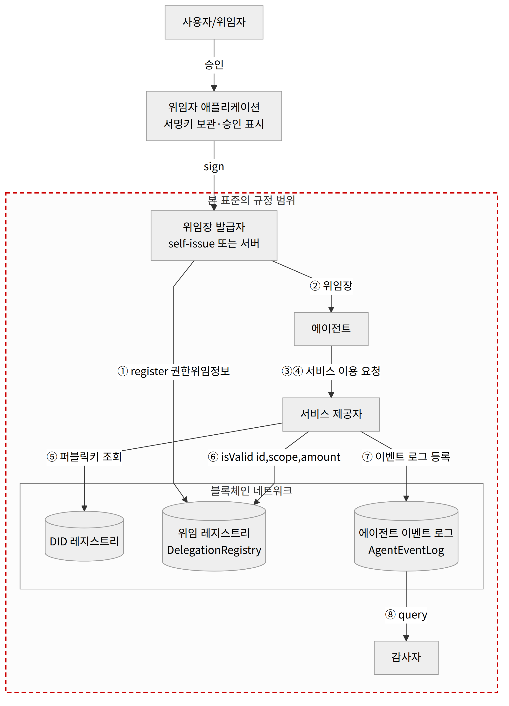
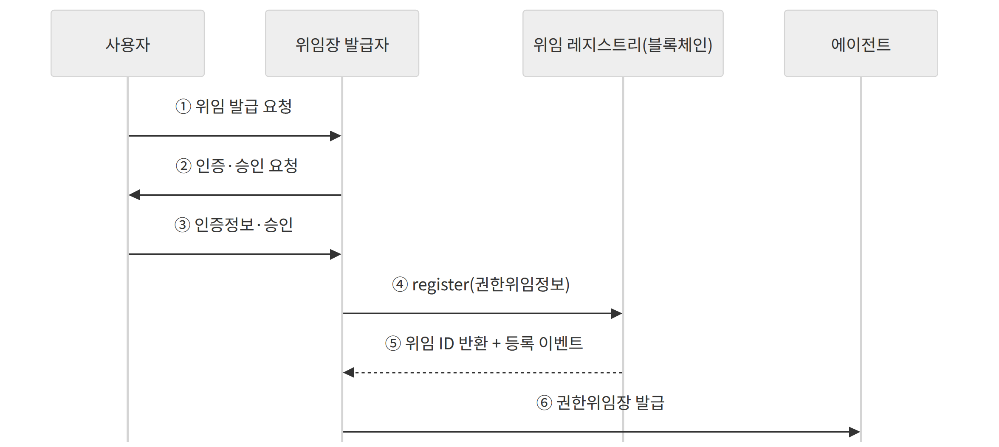
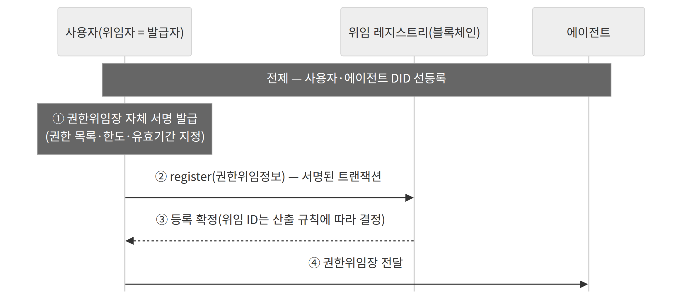
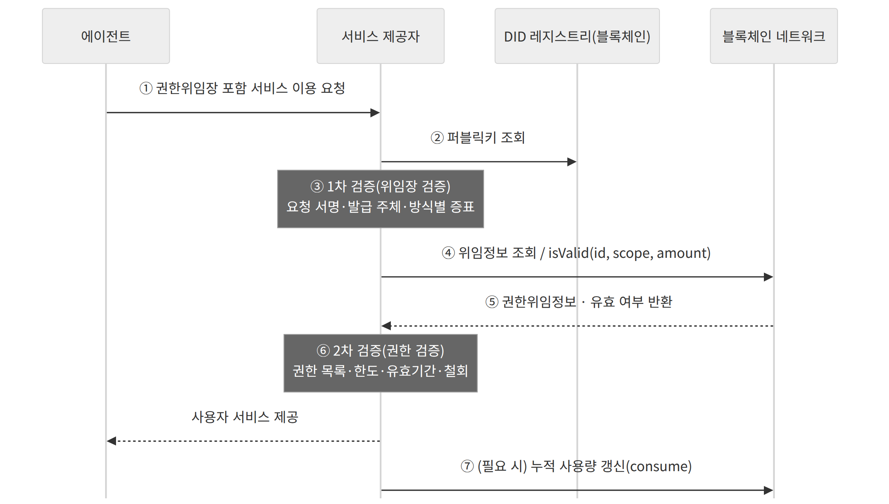
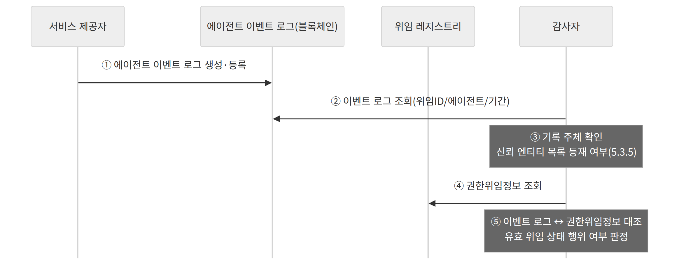

정보통신단체표준(국문표준)

TTAx.xx-xx.xxxx/R1 (과제번호 2026-P1420)

---

# 에이전트 권한위임 및 검증을 위한 블록체인 기반 신뢰 프레임워크

## Blockchain-based Trust Framework for Agent Authority Delegation and Verification

> draft v1.6 (2026-09-04) — PG1006 제43차 정기회의(2026-08-31) 심의 의견 반영(v1.5)에 더하여 구현팀 검토의견 5건을 반영한 제44차 3차 심의 예정본.
> 정본은 TTA 제출 docx이며, 본 파일은 repo 관리용 마크다운 사본이다.

---

| 표준초안 검토 위원회 | 블록체인기반기술 프로젝트그룹(PG1006) |
|---|---|
| 표준안 심의 위원회 | 지능정보기반 기술위원회(TC10) |

| 구분 | 성명 | 소속 | 직위 | 위원회 및 직위 |
|---|---|---|---|---|
| 표준(과제) 제안 | 송주한 | ㈜씨피랩스 | 연구소장·부사장 | - |
| 표준 초안 에디터 | 송주한 | ㈜씨피랩스 | 연구소장·부사장 | - |
|  | 유순덕 | 한세대학교 | 교수 | - |
|  | 정종식 | ㈜씨피랩스 | 이사 | - |
|  | 김정소 | ㈜씨피랩스 | 이사 | - |
| 사무국 담당 | 미정 | TTA | - | - |

본 표준에 대한 저작권은 TTA에 있으며, TTA와 사전 협의 없이 이 문서의 전체 또는 일부를 상업적 목적으로 복제 또는 배포해서는 안 됩니다.
본 표준 발간 이전에 접수된 지식재산권 확약서 정보는 본 표준의 ‘부록(지식재산권 확약서 정보)’에 명시하고 있으며, 이후 접수된 지식재산권 확약서는 TTA 웹사이트에서 확인할 수 있습니다. 준용표준인 경우 해당 표준화기구 또는 단체의 웹사이트에서 이를 확인해야 합니다.
본 표준과 관련하여 접수된 확약서 외의 지식재산권이 존재할 수 있습니다.
발행인 : 한국정보통신기술협회 회장
발행처 : 한국정보통신기술협회
13591, 경기도 성남시 분당구 분당로 47
Tel : 1551-1774, Fax : 031-724-0109
발행일 : 20xx. xx. xx.


## 서 문

### 1 표준의 목적

자율적 에이전트가 결제, 거래, 계약 등 실질적 권한을 사용자 대신 행사하는 서비스가 확산되고 있으나, 현행 권한위임은 API 키·세션 토큰의 전면 이양과 같은 서비스별 임시방편에 의존하고 있다.
그 결과 다음과 같은 문제가 발생한다.
- 위임 범위를 벗어난 행위를 차단·검증할 표준 절차가 없다(권한 초과).
- 위임의 내용과 조건을 제3자가 검증할 수 없다(불투명성).
- 행위 기록이 특정 사업자 내부에 종속되어 위·변조에 취약하다(감사 불가능).
한편 에이전트 간 통신과 위임 토큰 형식을 다루는 국제 규격들은 위임자 본인의 인증·승인 절차를 범위에서 제외하고 있어, 사람이 위임을 승인하고 그 승인이 검증·감사 가능한 형태로 남는 구간이 규정되어 있지 아니하다.
이 표준의 목적은 에이전트의 권한 초과 행위를 방지하고, 위임 범위의 투명성·무결성을 보장하며, 위임 이행 내역의 변조 불가능한 감사를 달성하여, 자율적 에이전트의 신뢰 가능한 대규모 상용화 기반을 마련하는 데 있다.

### 2 주요 내용 요약

이 표준은 사용자가 에이전트에게 권한을 위임할 때, 권한위임정보를 블록체인에 등록하고 위임장(검증 가능한 위임 자격증명, 스마트 컨트랙트, 위임 토큰, 일회용키 중 하나의 형태)을 발급하며, 서비스 제공자가 검증 시점에 블록체인을 참조하여 위임의 유효성을 확인하고, 감사자가 행위 이력과 권한위임정보를 대조하여 감사하는 프레임워크의 구조와 동작 시나리오를 규정한다.

### 3 인용 표준과의 비교

#### 3.1 인용 표준과의 관련성

해당 사항 없음

#### 3.2 인용 표준과 본 표준의 비교표

해당 사항 없음

## Preface

### 1 Purpose

Autonomous agents increasingly exercise substantive authority, such as payments, trading, and contracting, on behalf of users, while current delegation practices rely on service-specific workarounds such as handing over API keys or session tokens.
As a result, the following problems arise.
- There is no standard procedure to block or verify actions beyond the delegated scope (authority excess).
- The content and conditions of a delegation cannot be verified by third parties (opacity).
- Activity records are confined within individual service providers and are vulnerable to tampering (unauditability).
Meanwhile, international specifications addressing agent-to-agent communication and delegation token formats exclude the delegator’s own authentication and approval procedure from their scope, leaving unspecified the segment in which a person approves a delegation and that approval remains verifiable and auditable.
The purpose of this standard is to prevent authority-exceeding actions by an agent, to guarantee the transparency and integrity of the delegated scope, and to achieve tamper-evident auditing of delegation execution, thereby establishing a foundation for the trustworthy and large-scale commercialization of autonomous agents.

### 2 Summary

This standard specifies the architecture and operational scenarios of a framework in which, when a user delegates authority to an agent, the delegation information is registered on a blockchain and a delegation credential is issued in one of the following forms: a verifiable delegation credential, a smart contract, a delegation token, or a one-time key; a service provider verifies the validity of the delegation by referring to the blockchain at the time of verification; and an auditor audits the execution by cross-checking the action history against the delegation information.

### 3 Comparison with Reference Standards

#### 3.1 Relationship to Reference Standards

None

#### 3.2 Comparison Table between Reference Standards and This Standard

None

## 1 적용 범위

### 1.1 개요

이 표준은 사용자가 에이전트에게 특정 권한을 위임하여 서비스를 대리 수행하도록 할 때, 위임장 발급자가 권한위임정보를 블록체인에 저장하고, 서비스 제공자가 검증 시점에 블록체인에 저장된 권한위임정보를 참조하여 위임의 유효성을 확인하며, 위임 이행 내역을 제3자가 검증할 수 있도록 하는 프레임워크의 구조와 동작 시나리오를 규정한다.
이 표준은 사용자(위임자), 에이전트, 위임장 발급자, 서비스 제공자, 감사자 간의 상호작용과, 권한위임의 등록·발급·검증·감사 절차를 정의한다.
하나의 권한위임장은 복수 권한의 조합을 담을 수 있다(위임장과 권한은 일대다).

### 1.2 적용 대상 및 제외

위임의 등록과 철회는 블록체인의 확정성(finality)이 확보된 이후에 효력을 가진다.
온체인 처리 대상 위임의 선정 기준은 서비스 특성(실시간성·위험도·감사 필요성)에 따라 정한다.
다음의 위임 유형은 본 표준의 적용 범위에서 제외한다.
- 실시간 승인(real-time permit)이 요구되어 블록체인 확정성 지연을 허용할 수 없는 유형의 위임
- 에이전트가 위임받은 권한을 다른 에이전트에게 다시 위임하는 재위임
승인 요청 및 권한위임장 전달의 구체적 프로토콜 바인딩은 본 표준에서 규정하지 아니하며, 별도의 프로파일에서 정한다.
비고 1 — 실시간 승인이 요구되는 위임은 오프체인에서 사전 위임한 뒤 온체인으로 정산하는 구성으로 본 프레임워크를 적용할 수 있다.
비고 2 — 본 표준에서 '블록체인 기반'은 권한위임의 등록·검증·감사 방식이 블록체인을 기반으로 함을 의미하며, 에이전트 자체가 블록체인 기반임을 의미하지 아니한다.

## 2 인용 표준

다음 문서는 본 표준의 적용에 필수적인 인용 표준이다. 발행 연도가 표기된 인용 표준은 인용된 판(추록 포함)만 적용하며, 발행 연도가 표기되지 않은 인용 표준은 최신판을 적용한다.
[1] W3C Recommendation, Decentralized Identifiers (DIDs) v1.0, 2022-07-19.
[2] W3C Recommendation, Verifiable Credentials Data Model v2.0, 2025-05-15.
[3] IETF RFC 3339, Date and Time on the Internet: Timestamps, 2002-07.
[4] IETF RFC 8446, The Transport Layer Security (TLS) Protocol Version 1.3, 2018-08.

## 3 용어 정의 근거 자료

3.1 감사자(auditor) : 블록체인에 등록된 권한위임정보와 에이전트 이벤트 로그를 참조하여, 에이전트가 유효한 위임 상태와 권한 범위 내에서 적법하게 행위하였는지 검증하고 감사하는 역할. 특정 기관이나 지정된 자로 한정되지 아니하며, 위임자·서비스 제공자·제3자 등 블록체인 기록을 조회할 수 있는 누구나 수행할 수 있다.
3.2 권한범위(scope) : 에이전트가 발급받은 권한위임장을 통해 수행할 수 있는 행위의 집합
비고 – 단일 권한 또는 복수 권한의 조합으로 표현될 수 있으며, 접근 가능한 자원이나 수행 가능한 기능의 한계를 정의함.
3.3 권한위임장(delegation credential) : 위임장 발급자가 위임 사실과 그 내용을 증명하기 위하여 발급하는 증표
비고 – 위임장은 검증 가능한 위임 자격증명(VC), 스마트 컨트랙트 어드레스, 위임 토큰, 일회용 키 중 하나의 형태로 발급됨. 권한위임정보(3.4) 자체는 어느 형태에서든 블록체인의 위임 레지스트리(3.12)에 등록되며, 위임장은 이를 증명·식별하는 증표이다. 스마트 컨트랙트 어드레스 형태는 위임 레지스트리 컨트랙트와 위임 ID로 온체인 권한위임정보를 직접 참조하고, VC·위임 토큰·일회용 키 형태는 사용자 서명이 담긴 증표를 전달하여 검증 시 위임 ID로 온체인 권한위임정보와 대조됨.
3.4 권한위임정보(delegation information) : 사용자가 에이전트에게 위임한 권한의 구체적인 내용으로, 블록체인에 등록되는 데이터 정보
3.5 노드(node) : 분산원장의 전체 또는 부분 복제본을 저장하고 블록체인 네트워크에 참여하는 장치 또는 프로세스
3.6 무결성 앵커(integrity anchor) : 오프체인에 보관된 데이터의 해시값을 블록체인에 등록하여 해당 데이터의 위·변조를 사후에 탐지할 수 있게 하는 값
비고 – 앵커는 개별 데이터의 해시일 수도 있고, 복수 데이터의 해시를 집약한 값(예: 머클 루트)일 수도 있다.
3.7 서비스 제공자(service provider) : 에이전트로부터 서비스 이용 요청을 수신하여 해당 요청의 유효성과 권한 위임의 유효성을 검증한 후, 최종 사용자 서비스를 제공하는 주체
3.8 에이전트(agent) : 사용자로부터 권한을 위임받아 사용자 서비스를 대리 수행하는 자율적 소프트웨어 주체
비고 – 에이전트는 사용자의 개입 없이 독립적으로 판단하고 행동할 수 있는 자율성을 가지며, 위임받은 권한 범위 내에서만 행위를 수행함.
3.9 에이전트 이벤트 로그(agent event log) : 에이전트가 수행한 행위 이력을 위임 ID(Delegation ID)와 결합하여 블록체인에 기록한 변조 불가능한 감사 로그
3.10 온체인(on-chain) : 데이터가 블록체인에 저장되어 그 무결성과 조회 가능성이 블록체인에 의하여 보장되는 상태
비고 – 블록체인 외부의 저장소 또는 통신 구간에 존재하는 상태를 오프체인(off-chain)이라 한다.
3.11 위임 검증(delegation verification) : 서비스 제공자가 권한위임장과 블록체인의 권한위임정보를 비교·참조하여, 에이전트의 요청이 권한범위, 한도, 유효기간 및 철회 여부에 부합하는지 확인하는 일련의 절차
3.12 위임 레지스트리(delegation registry) : 권한위임정보를 저장, 수정, 조회 및 관리하는 블록체인 상의 분산 등록부
3.13 위임자(delegator) : 에이전트에게 자신의 권한 중 일부 또는 전부를 위임하는 사용자
3.14 위임장 발급자(delegation issuer) : 권한위임정보에 대응하는 권한위임장을 발급하는 주체
비고 – 위임장 발급자는 사용자(위임자) 자신이 직접 서명하여 발급하는 주체가 될 수도 있고, 신뢰된 제3자의 발급자 서버가 될 수도 있음.
3.15 철회(revocation) : 위임자가 이미 발급된 권한위임장의 효력을 지정된 유효기간이 만료되기 전에 명시적으로 무효화하는 행위
※ 용어 출처 — 기존 표준을 인용하거나 개념을 참고한 항을 아래에 표시하며, 그 밖의 위임 특화 용어는 본 표준에서 정의한다.
[출처(3.3, 3.7, 3.11, 3.12, 3.14)] TTAK.KO-12.0359-Part1, 분산ID를 활용한 신원관리 프레임워크 제1부: 프레임워크 구성 및 모델, 2020 — 발급자·크리덴셜·저장소·검증자(서비스 제공자)·검증 개념(참고).
[출처(3.15)] W3C, Verifiable Credentials Data Model 2.0, §4.10 Status — 자격증명 상태(credentialStatus)를 통한 철회(revocation) 개념(참고).
[출처(3.5)] TTAK.KO-10.1565-Part1, 블록체인 기반 제조데이터 거래 플랫폼 제1부: 개념 및 요구사항 — 노드 개념(참고).
[출처(3.10)] TTAK.KO-12.0336, 블록체인 용어정의 — 온체인·오프체인 개념(참고).
[본 표준에서 정의] 3.1 감사자, 3.2 권한범위, 3.4 권한위임정보, 3.6 무결성 앵커, 3.8 에이전트, 3.9 에이전트 이벤트 로그, 3.13 위임자 — 기존 표준에 대응 정의가 없어 본 표준에서 정의한다.

## 4 약어

본 표준에서 사용하는 약어는 <표 4-1>과 같다.

**<표 4-1> 약어**

| 약어 | 설명 |
|---|---|
| DID | Decentralized Identifier |
| DLT | Distributed Ledger Technology |
| EIN | Ethereum Identity Number (ERC-1484) |
| IPR | Intellectual Property Rights |
| TLS | Transport Layer Security |
| UTC | Coordinated Universal Time |
| VC | Verifiable Credential |

## 5 에이전트 권한위임 및 검증을 위한 블록체인 기반 신뢰 프레임워크 구조

### 5.1 구조 개요

본 프레임워크는 위임 등록·위임장 발급·검증·감사의 네 모듈과, 권한위임정보 및 에이전트 이벤트 로그를 저장하는 블록체인 네트워크로 구성된다. 각 모듈은 블록체인의 위임 레지스트리와 에이전트 이벤트 로그에 대해 등록·조회 연산을 수행한다.
프레임워크에 참여하는 주체는 <표 5-1>과 같다.

**<표 5-1> 프레임워크 참여 주체**

| 주체 | 역할 |
|---|---|
| 위임자(사용자) | 에이전트에게 권한을 위임하고, 위임을 철회할 수 있다. |
| 위임자 애플리케이션 | 위임자의 서명키를 보관하고, 권한위임 승인 요청을 표시하여 위임자의 승인과 서명을 수행한다. |
| 위임장 발급자 | 권한위임정보에 대응하는 권한위임장을 발급한다. 사용자 자체 서명(self-issue) 또는 발급자 서버 형태가 가능하다. |
| 에이전트 | 권한위임장을 획득하여 위임 범위 내에서 사용자 서비스를 대리 요청한다. |
| 서비스 제공자 | 서비스 이용 요청의 유효성과 권한위임장의 유효성을 검증한 후 서비스를 제공한다. |
| 감사자 | 권한위임정보와 에이전트 이벤트 로그를 대조하여 유효 위임 상태 여부를 감사한다. 별도의 권한 부여 없이 블록체인 기록만으로 수행할 수 있다. |
| 블록체인 네트워크 | 위임 레지스트리와 에이전트 이벤트 로그를 저장하는 분산원장. |
| DID 레지스트리 | 사용자·에이전트의 DID에 대응하는 퍼블릭키를 제공한다. |

주체 간 오프체인 통신은 TLS(Transport Layer Security, 전송 계층 보안)를 적용한다.
본 프레임워크의 전체 구조와 주체 간 상호작용은 (그림 5-1)과 같다.



*(그림 5-1) 블록체인 기반 신뢰 프레임워크 구조*

#### 5.1.1 신뢰 관계

본 프레임워크의 신뢰 관계는 다음과 같다. 각 항은 해당 주체를 신뢰하기 위한 조건 또는 신뢰의 근거를 규정한다.
- 위임자(사용자) : 자신의 DID에 대응하는 서명키를 안전하게 관리하는 것을 전제로, 위임자의 서명을 권한위임에 대한 최종 승인의 근거로 신뢰한다.
- 위임자 애플리케이션 : 위임자의 서명키를 보호하고 승인 내용을 위임자에게 정확히 표시하는 것을 신뢰의 조건으로 한다. 애플리케이션의 무결성을 검증할 수단이 있는 경우, 위임장 발급자는 이를 승인 처리의 조건으로 요구할 수 있다.
- 위임장 발급자 : 발급자 서버 형태를 사용하는 경우, 신뢰 엔티티 목록(5.3.5)에 등재된 발급자가 발급한 위임장만을 신뢰한다. 위임자가 자체 서명하여 발급한 경우 발급자에 대한 별도의 신뢰를 요구하지 아니한다.
- 에이전트 : 신뢰 대상이 아니다. 에이전트의 행위는 검증(5.5)과 감사(5.6)의 대상이며, 위임 범위의 준수는 가정이 아니라 검증으로 확인한다.
- 서비스 제공자 : 에이전트 이벤트 로그의 기록 주체로서 신뢰가 요구되며, 신뢰 엔티티 목록(5.3.5)에 등재된 서비스 제공자가 기록한 이벤트 로그만을 감사의 근거로 신뢰한다. 검증 주체로서의 서비스 제공자는 별도의 신뢰를 요구하지 아니한다(검증 결과는 제공자 자신에게 귀속되며, 이행 내역은 감사로 사후 확인된다).
- 감사자 : 신뢰 대상이 아니다. 감사는 블록체인에 기록된 정보의 대조로 수행되므로 누구나 동일하게 재현할 수 있다(5.6).
- 블록체인 네트워크 : 기록의 무결성과 가용성을 신뢰의 기반으로 하며, 본 프레임워크는 원장·합의 방식에 중립적이다.
- DID 레지스트리 : DID에 대응하는 퍼블릭키의 신뢰 기점이며, 모든 서명 검증은 이 값을 기준으로 한다.
비고 — 주체 간 신뢰는 DID 및 블록체인 기록을 통해 검증 가능한 형태로 성립하며, 특정 중앙 신뢰 기관에 의존하지 아니한다.

### 5.2 위임 등록 모듈

위임 등록 모듈은 사용자 인증 및 권한위임 승인 절차를 거쳐, 사용자의 권한이 에이전트로 위임되었음을 증명하는 권한위임정보를 블록체인의 위임 레지스트리에 등록한다.
권한위임정보 등록 시 다음 항목이 결정된다.
- 위임 ID(delegationId) : 사용자·에이전트·논스(nonce)의 해시로 산출되는 고유 식별자. 위임 ID는 특정 주체가 부여하는 값이 아니라 산출 규칙에 따라 결정된다.
- 권한범위(scope) : 에이전트가 수행 가능한 행위의 목록. 복수 권한의 조합을 지원한다(예: 거래/팔로우/전송/출금). 온체인 인코딩의 예로 비트마스크를 사용할 수 있다(구현 선택).
- 한도 : 위임장 수준의 전체 한도(totalCap — 누적 상한)와 개별 권한 수준의 개별 한도(maxAmount — 1회 요청 상한)로 구분한다(5.4 참조). 누적 상한 0은 무제한을 의미한다.
- 유효기간(validFrom, validUntil) : 위임의 효력 발생·만료 시점.
- 철회 URL(revocationURL)·추적 URL(trackingURL) : 위임장 데이터 모델(5.4)의 필수 참조 항목.
등록이 완료되면 등록 이벤트(DelegationRegistered)가 발생하며, 이후 위임장 발급(5.3)으로 이어진다.
비고 1 — 자기완결형 증표(검증 가능한 위임 자격증명, 위임 토큰)를 사용하는 경우, 권한위임정보의 온체인 등록은 권한위임정보에 대한 무결성 앵커(3.6)와 상태 정보(유효·철회)의 등록으로 갈음할 수 있다. 이 경우 서비스 제공자는 증표에 담긴 권한위임정보가 온체인 앵커와 일치함을 확인하여야 한다(5.5 참조).
비고 2 — 무결성 앵커는 해당 위임의 등록 시점에 온체인에 반영되어야 한다. 복수 위임의 앵커를 집약하여 반영하는 경우, 앵커가 확정되기 전의 위임은 유효한 것으로 인정하지 아니한다(1.2 참조).
비고 3 — 상태 정보는 블록체인에 직접 등록하거나, 무결성 앵커로 보호되는 상태 목록으로 관리할 수 있다. 어느 경우에도 위임의 유효·철회 상태는 온체인을 기준으로 판단하며, 철회의 효력 발생 시점은 5.2.1에 따른다.

#### 5.2.1 위임 철회

위임자는 유효기간이 만료되기 전에 이미 발급된 권한위임장의 효력을 무효화할 수 있다.
철회는 위임 레지스트리에 등록된 권한위임정보의 상태를 무효로 갱신하는 방식으로 수행하며, 철회 이벤트(DelegationRevoked)가 발생한다. 위임자는 위임장 데이터 모델(5.4)의 철회 URL을 통하여 철회를 요청할 수 있다.
철회의 효력은 블록체인의 확정성 확보 이후 발생하며(1.2 참조), 서비스 제공자는 검증 시점의 온체인 상태를 기준으로 철회 여부를 판단한다(5.5 참조).
철회된 위임은 다시 사용할 수 없으며, 동일한 권한을 다시 위임하려면 새로운 권한위임정보를 등록하여야 한다.
철회와 유효기간은 위임장 수준에 적용된다. 개별 권한의 한도 소진은 철회가 아니라 검증 시 부합 여부의 판정으로 처리한다(5.5 참조).

### 5.3 위임장 발급 모듈

위임장 발급자는 등록된 권한위임정보에 대응하는 권한위임장을 다음 네 가지 방식 중 하나로 에이전트에게 발급한다. 위임장의 형태는 검증 방식(5.5)을 결정한다. 하나의 권한위임장은 복수 권한의 조합을 담을 수 있다(위임장과 권한은 일대다, 5.4 참조).
네 가지 방식은 증표(권한위임장을 이르며, 이하 같다)의 자기완결성(증표 자체에 위임 내용과 사용자 서명값을 포함하는지 여부)과 사용 지속성(반복 사용 또는 일회성)을 기준으로 분류된다.
검증 가능한 위임 자격증명과 위임 토큰은 자기완결형, 스마트 컨트랙트 방식은 온체인 권한위임정보를 직접 가리키는 참조형이며, 일회용키 방식은 일회성 키 자체가 증표가 되는 형태이다.
어느 방식을 택하더라도 권한위임정보는 블록체인에 등록되고 검증 시점에 대조되므로(5.5 참조), 증표 형식의 선택은 검증 결과에 영향을 주지 않는다.
각 방식의 특성과 적합 환경의 비교는 <표 5-2>와 같다.

**<표 5-2> 위임장 발급 방식 비교**

| 방식 | 증표 성격 | 장점 | 단점·제약 | 적합 환경 |
|---|---|---|---|---|
| 검증 가능한 위임 자격증명(VC) | 자기완결형 | W3C VC 2.0 호환으로 기존 DID/VC 인프라와 상호운용, 발급자 서명의 독립 검증 가능 | VC 발급·검증 스택 필요, 동적 상태(철회·누적 사용량)는 온체인 대조 필수 | DID/VC 인프라를 보유한 서비스 |
| 스마트 컨트랙트 | 참조형 | 증표 위조가 무의미(온체인 직접 참조), 구현 단순, 참조 구현 존재 | 검증 시 블록체인 조회 필수(오프라인 검증 불가) | 온체인 연동 서비스 일반 |
| 위임 토큰 | 자기완결형(경량) | 경량, 기존 웹 토큰 처리 인프라와 친화 | 표준 크리덴셜 대비 표현력·상호운용성 제한 | 경량 API 중심 서비스 |
| 일회용키 | 일회성 키 | 재사용 공격 원천 차단, 키 탈취 피해 최소화 | 위임 건별 키 발급·등록 오버헤드 | 고위험·고액 거래 환경 |

비고 : 새로운 발급 방식이 요구되는 경우, 증표의 자기완결성·사용 지속성 축 위에서 위 네 방식의 변형으로 수용하거나 도메인별 프로파일로 확장할 수 있다.

#### 5.3.1 검증 가능한 위임 자격증명(VC) 방식

사용자 DID로 서명한 검증 가능한 위임 자격증명(VC)을 위임장으로 발급한다. 서비스 제공자는 사용자 DID에 대응하는 퍼블릭키를 DID 레지스트리에서 획득하여 VC의 사용자 서명값을 검증한다.

#### 5.3.2 스마트 컨트랙트 방식

권한위임정보를 포함한 스마트 컨트랙트(위임 레지스트리)에 위임을 등록하고, 해당 위임을 식별하는 컨트랙트 어드레스 및 위임 ID를 위임장으로 발급한다. 검증은 스마트 컨트랙트가 직접 수행한다(5.5 참조).
비고 : 본 방식은 참조 구현에서 구현·배포되었으며, 위임 레지스트리는 register(), isValid(), revoke(), consume(), getDelegation() 연산을 제공한다.

#### 5.3.3 위임 토큰 방식

사용자 서명값을 포함한 위임 토큰을 위임장으로 발급한다. 서비스 제공자는 사용자 DID에 대응하는 퍼블릭키로 토큰의 사용자 서명값을 검증한 후, 블록체인에서 권한위임정보를 조회하여 요청의 유효성을 확인한다.

#### 5.3.4 일회용키 방식

일회용키의 임시 프라이빗키를 위임장으로 발급한다. 에이전트는 임시 프라이빗키로 서비스 이용 요청에 서명하고, 서비스 제공자는 DID 레지스트리에서 획득한 임시 퍼블릭키로 에이전트 서명값을 검증한다. 일회용 특성으로 재사용 공격을 방지한다(7.2 참조).

#### 5.3.5 신뢰 엔티티 목록

본 프레임워크는 신뢰가 요구되는 주체의 식별자(DID)를 신뢰 엔티티 목록으로 관리한다. 등재 대상은 다음과 같다.
- 위임장 발급자(발급자 서버 형태를 사용하는 경우)
- 서비스 제공자(에이전트 이벤트 로그의 기록 주체)
서비스 제공자는 신뢰 엔티티 목록을 기준으로 위임장의 발급 주체를 검증하여야 하며, 목록에 등재되지 아니한 발급자가 발급한 위임장은 유효한 것으로 인정하지 아니한다.
감사자는 에이전트 이벤트 로그의 기록 주체가 신뢰 엔티티 목록에 등재된 서비스 제공자인지 확인하여야 하며, 등재되지 아니한 주체가 기록한 이벤트 로그는 감사의 근거로 사용하지 아니한다.
신뢰 엔티티 목록은 온체인 레지스트리(스마트 컨트랙트) 또는 검증 주체가 참조하는 신뢰 목록의 형태로 관리할 수 있다. 검증 주체는 검증 시점의 목록 상태를 기준으로 판단하며, 목록을 온체인 레지스트리로 관리하는 경우 엔티티의 등록·갱신·폐지 이력을 조회할 수 있어야 한다.
위임자가 자체 서명하여 발급한 경우에는 발급자가 위임자 자신이므로 발급자 등재를 요구하지 아니한다.

### 5.4 위임장 데이터 모델

권한위임장 및 그에 대응하는 권한위임정보의 데이터 모델은 위임장 수준과 개별 권한 항목의 2계층으로 구성하며, <표 5-3>과 같다.
권한은 허용되는 행위의 목록(capability list)으로 열거하여 표현하며, 한도는 수치 상한으로 표현한다. 권한 목록은 허용 행위만을 열거하며 금지 행위를 기재하지 아니한다. 행위 전반의 제약은 위임장 수준의 전체 한도로 표현한다.
본 데이터 모델의 JSON 표현 예시는 부록 Ⅰ.1에 보인다.

**<표 5-3> 위임장 데이터 모델**

| 필드 | 설명 |
|---|---|
| **위임장 수준** |  |
| 사용자 DID | 위임자의 분산 식별자 |
| 에이전트 DID | 수임 에이전트의 분산 식별자 |
| 사용자 ID / 에이전트 ID | DID 외 식별자(예: ERC-1484 EIN 등) |
| 위임 ID | 위임의 고유 식별자 |
| 철회 URL | 사용자가 위임을 철회할 수 있는 참조 주소 |
| 추적 URL | 위임 사용 내역을 확인하는 참조 주소 |
| 전체 한도 | 위임장 전체에 적용되는 누적 상한(totalCap). 0은 무제한을 의미한다. (5.2 참조) |
| 유효기간 | 위임의 효력 발생·만료 시점 (5.4.1 참조) |
| 수행 가능 권한 목록 | 에이전트가 수행할 수 있는 행위의 목록(capability list). 각 항목은 아래 개별 권한 항목으로 구성된다. |
| **개별 권한 항목(권한 목록의 각 항목)** |  |
| 행위 유형 | 허용되는 행위의 유형(actionType)(예: 결제·전송·조회) |
| 개별 한도 | 해당 행위의 1회 요청 상한(maxAmount) |
| 개별 유효조건 | 해당 권한에 한정되는 추가 조건(선택 필드) |

비고 — 에이전트 간 재위임은 본 표준의 적용 범위에서 제외되나(1.2 참조), 위임 ID를 상위 위임에 대한 참조 값으로 사용하면 위임 관계를 연쇄적으로 표현할 수 있으므로, 향후 개정에서 본 데이터 모델의 확장으로 수용할 수 있다.

#### 5.4.1 시각 표현

위임장 등 오프체인 표현(VC·토큰)의 시각 값은 RFC 3339의 UTC 형식으로 표기한다(예: 2026-06-24T00:00:00Z).
온체인 권한위임정보의 정수형 타임스탬프(Unix epoch 초)와 상호 변환 가능하며, 검증 시 양 표현은 동일 시점을 가리켜야 한다.
시각 비교는 UTC 기준으로 수행한다.

### 5.5 검증 모듈

서비스 제공자는 에이전트의 서비스 이용 요청과 그에 첨부된 권한위임장에 대하여 2단계 검증을 수행한다. 서비스 제공자에 대한 신뢰 확인은 5.3.5(신뢰 엔티티 목록)에 따른다.
1) 1차 검증(위임장 검증) : 서비스 이용 요청에 대한 에이전트의 서명값을 검증한다. 요청 서명 키는 온체인 권한위임정보의 에이전트 DID에 대응하는 퍼블릭키 또는 위임에 바인딩된 일회용 키여야 한다(7.2 참조). 위임장을 발급자 서버가 발급한 경우에는 증표 검증에 앞서 5.3.5의 신뢰 엔티티 목록을 기준으로 위임장의 발급 주체를 검증한다. 위임자가 자체 서명하여 발급한 경우에는 발급자가 위임자 자신이므로 이 단계를 적용하지 아니한다. 스마트 컨트랙트 방식은 위임 등록 자체가 발급 승인에 해당하고, 일회용키 방식은 임시 퍼블릭키가 위임자의 DID 문서에 등록된 것을 신뢰 근거로 하므로(7.2 참조), 두 방식은 별도의 발급 주체 검증을 요구하지 아니한다. 이어서 위임장 방식별로 증표를 추가 검증한다.
- VC 방식 : 사용자 DID 퍼블릭키로 VC의 사용자 서명값 검증
- 스마트 컨트랙트 방식 : 컨트랙트 어드레스로 위임 레지스트리에 검증 요청
- 위임 토큰 방식 : 사용자 퍼블릭키로 토큰의 사용자 서명값 검증
- 일회용키 방식 : 별도의 증표 검증 없음(요청의 에이전트 서명 검증에 DID 레지스트리의 임시 퍼블릭키를 사용)
2) 2차 검증(권한 검증) : 권한위임장을 참조하여 블록체인으로부터 권한위임정보 또는 그 무결성 앵커와 상태 정보를 획득하고, 요청이 권한범위·한도·유효기간·철회 여부에 부합하는지 확인한다. 무결성 앵커로 갈음하는 경우(5.2 비고 1)에는 증표에 담긴 권한위임정보와 온체인 앵커의 일치를 먼저 확인한다. 스마트 컨트랙트 방식의 경우 isValid(위임ID, 요구권한, 요청금액)이 유효 여부와 사유를 반환한다.
증표에 기재된 위임 내용이 블록체인에 등록된 권한위임정보와 일치하지 아니하는 경우, 서비스 제공자는 요청을 거부하여야 한다. 판정은 블록체인에 등록된 권한위임정보를 기준으로 하며, 무결성 앵커로 갈음하는 경우에는 앵커와의 일치가 확인된 증표의 내용을 기준으로 한다.
두 검증을 모두 통과한 경우에만 사용자 서비스를 제공한다. 한도 추적이 필요한 경우 서비스 제공자는 누적 사용량 갱신(consume) 연산을 호출한다.

#### 5.5.1 위임장 방식별 검증 절차

서비스 제공자는 공통적으로 ① 1차 검증(위임장 검증)과 ② 2차 검증(권한 검증)을 수행하되, 위임장 방식에 따라 ①의 절차를 다음과 같이 구체화한다. ①에는 발급자 서버가 발급한 위임장의 경우 5.3.5에 따른 발급 주체 검증이 포함된다.
- 검증 가능한 위임 자격증명(VC) 방식 : 사용자 DID에 대응하는 퍼블릭키로 VC의 사용자 서명값과 유효기간 등 증표 자체의 유효성을 확인한다.
- 스마트 컨트랙트 방식 : 증표가 온체인 권한위임정보에 대한 참조이므로, ①은 위임 레지스트리에 대한 유효성 판정 요청으로 ②와 통합하여 수행한다.
- 위임 토큰 방식 : 사용자 DID에 대응하는 퍼블릭키로 토큰의 사용자 서명값을 확인한다.
- 일회용키 방식 : 별도의 증표 검증 없이 요청의 에이전트 서명 검증으로 ①을 갈음한다(5.5 참조).

### 5.6 감사 모듈

에이전트의 서비스 이행 시, 서비스 제공자는 에이전트 이벤트 로그를 생성하여 블록체인에 등록한다.
감사는 특정 주체에게 부여되는 권한이 아니라, 블록체인에 기록된 권한위임정보와 에이전트 이벤트 로그가 누구에게나 대조 가능한 형태로 남는 데에서 성립한다.
에이전트 이벤트 로그는 다음을 포함한다: 위임 ID, 에이전트 식별자, 행위 유형(actionType), 행위 페이로드의 해시(actionHash — 원문 비노출), 서비스 제공자 식별자, 타임스탬프, 블록 번호.
에이전트 이벤트 로그는 기록 주체(서비스 제공자)를 트랜잭션 발신자 또는 서명으로 확인할 수 있어야 한다.
감사자는 이벤트 로그의 기록 주체가 신뢰 엔티티 목록(5.3.5)에 등재된 서비스 제공자인지 확인하여야 한다.
감사자는 위임 ID 또는 에이전트 식별자, 기간으로 이벤트 로그를 조회하고, 블록체인에 등록된 권한위임정보와 대조하여 에이전트가 유효한 위임 상태에서 행위하였는지를 감사한다.
비고 : 대규모 환경에서는 원문 이벤트를 오프체인에 저장하고 주기적으로 머클 루트(Merkle root)만 온체인에 앵커링하여 "블록체인에 등록" 요건을 충족하면서 비용을 절감할 수 있다. 또한 누적 사용량 기록의 배치·집계와 에이전트 이벤트 로그의 선택적 저장을 통해 온체인 기록량(쓰기 연산)을 조정할 수 있다.

#### 5.6.1 위임장 방식별 감사

감사자는 에이전트 이벤트 로그와 온체인 권한위임정보를 대조하여 이행 정합성을 확인하되, 위임장 방식에 따라 다음을 추가로 확인한다.
- 검증 가능한 위임 자격증명(VC)·위임 토큰 방식 : 증표에 기재된 위임 내용(위임 ID·권한범위 등)과 온체인 권한위임정보의 일치 여부를 확인한다.
- 스마트 컨트랙트 방식 : 위임 레지스트리의 등록·철회·누적 사용량 갱신 이력과 에이전트 이벤트 로그의 정합 여부를 확인한다.
- 일회용키 방식 : 임시 퍼블릭키가 해당 위임에 한정하여 사용되었는지를 확인한다.

## 6 프레임워크 동작 시나리오

### 6.1 권한위임 등록 시나리오

권한위임 등록과 이후 시나리오는 다음을 전제로 한다 — 사용자와 에이전트의 DID가 블록체인에 선등록되어 있고, 발급자 서버를 사용하는 경우 해당 발급자가, 이벤트 로그를 기록할 서비스 제공자가 신뢰 엔티티 목록(5.3.5)에 등재되어 있다.
권한위임 등록 절차는 (그림 6-1)과 같다.



*(그림 6-1) 권한위임 등록 시퀀스*

1) 사용자가 특정 에이전트에 대한 권한위임장 발급을 요청한다(권한범위·한도·유효기간 지정).
2) 위임장 발급자가 사용자에게 인증 정보와 권한위임 승인을 요청한다.
3) 사용자가 인증 정보와 승인 정보를 제출한다.
4) 위임장 발급자가 전자서명한 트랜잭션으로 권한위임정보를 위임 레지스트리(블록체인)에 등록한다.
5) 위임 레지스트리에 등록이 확정된다. 위임 ID는 산출 규칙(5.2)에 따라 결정된다.
6) 위임장 발급자가 5.3의 방식 중 하나로 권한위임장을 발급하고, 에이전트가 이를 획득한다.
비고 — 트랜잭션 전자서명 알고리즘의 예로 ECDSA가 있다. 본 표준은 특정 서명 알고리즘을 한정하지 아니한다.
위임자가 발급자 서버 없이 자체 서명하여 발급하는 경우의 절차는 (그림 6-2)와 같다.



*(그림 6-2) 사용자 직접 발급(자체 서명) 시퀀스*

1) 사용자가 권한위임장을 자체 서명하여 발급한다(권한 목록·한도·유효기간 지정).
2) 사용자가 전자서명한 트랜잭션으로 권한위임정보를 위임 레지스트리(블록체인)에 등록한다.
3) 위임 레지스트리에 등록이 확정된다(위임 ID는 산출 규칙에 따라 결정).
4) 사용자가 권한위임장을 에이전트에게 전달한다.

### 6.2 에이전트 서비스 요청 및 검증 시나리오

에이전트의 서비스 요청과 서비스 제공자의 검증 절차는 (그림 6-3)과 같다.



*(그림 6-3) 에이전트 서비스 요청 및 검증 시퀀스*

1) 에이전트가 권한위임장을 포함하여 서비스 이용 요청 정보를 서비스 제공자에게 전송한다.
2) 서비스 제공자가 1차 검증(위임장 검증)을 수행한다(요청 서명·발급 주체·방식별 증표 검증, 5.5 참조).
3) 서비스 제공자가 권한위임장을 참조하여 블록체인에서 권한위임정보를 조회하고 2차 검증(권한 검증)을 수행한다.
4) 권한범위·한도·유효기간·철회 여부를 모두 통과하면 사용자 서비스를 제공한다.
5) 한도 추적이 필요한 경우 누적 사용량을 갱신한다.

### 6.3 위임 이행 감사 시나리오

위임 이행에 대한 감사 절차는 (그림 6-4)와 같다.



*(그림 6-4) 위임 이행 감사 시퀀스*

1) 서비스 이행 시 서비스 제공자가 에이전트 이벤트 로그를 생성하여 블록체인에 등록한다.
2) 감사자가 위임 ID, 에이전트 식별자 또는 기간으로 이벤트 로그를 조회한다.
3) 감사자가 이벤트 로그의 기록 주체가 신뢰 엔티티 목록에 등재된 서비스 제공자인지 확인한다.
4) 감사자가 동일 위임 ID의 권한위임정보를 조회한다.
5) 감사자가 양자를 대조하여, 에이전트의 모든 행위가 유효한 위임 범위·기간·한도 내에서 이루어졌는지 판정한다. 위반 시 위반 항목을 식별한다.

## 7 키 관리 모델

### 7.1 개요

본 장은 에이전트가 서비스 이용 요청에 사용하는 키의 관리 모델을 규정한다. 키 관리는 위임의 등록·검증·철회(5장)와 결합하여 동작하며, 키 유출 시의 피해를 위임 단위로 한정하는 것을 설계 원칙으로 한다.

### 7.2 2계층 키 관리 모델

본 프레임워크는 에이전트 키를 지속형 식별 키와 단명형 서명 키의 2계층으로 분리하며, 그 구성은 <표 7-1>과 같다.

**<표 7-1> 에이전트 키 2계층 모델**

| 계층 | 키 | 용도 | 수명 |
|---|---|---|---|
| 지속형 | 에이전트 DID 키 | 에이전트의 식별·출처·평판 확인(KYA) | 장기(DID에 앵커링) |
| 단명형 | 위임 서명 키(일회용키) | 위임 범위 내 서비스 요청 서명 | 위임 단위·유효기간 한정 |

- 에이전트 DID(5.4, 위임장 데이터 모델)는 에이전트의 지속형 식별자로, 모든 위임이 에이전트 DID에 묶인다.
- 단명형 서명 키는 위임장 발급 방식 중 일회용키 방식(5.3.4)으로 구현된다. 발급자가 임시 프라이빗키를 에이전트에 발급하고, 서비스 제공자는 DID 레지스트리에서 임시 퍼블릭키를 조회하여 에이전트 서명을 검증한다. 일회용·단명 특성으로 키 탈취 시 피해 범위와 기간이 제한된다.
- 단명 키(임시 프라이빗키)의 발급자→에이전트 전달은 TLS로 보호된 채널을 통한다. 전달 구간이 노출되더라도 일회용·단명 특성과 온체인 철회에 의해 피해가 해당 위임 1건 이내로 제한된다.
- 임시 퍼블릭키는 DID 레지스트리에서 조회 가능하도록 등록하며, 위임자(사용자) DID 문서의 위임 검증 관계(capabilityDelegation)로 표현할 수 있다(W3C DID v1.0 참고). 검증 시 위임 ID로 온체인 권한위임정보와 대조된다.
- 키 자체를 회전·폐기하는 대신, 위임을 온체인에서 무효화(5.2.1 철회 / 5.6 감사)하는 것을 우선 폐기 수단으로 한다.

## 부록 Ⅰ 권한위임장 발급 방식별 예시

(본 부록은 표준을 보충하기 위한 내용으로 표준의 일부는 아님)
본 부록은 5.3에서 규정한 네 가지 위임장 발급 방식을 동일한 시나리오에 적용한 예시를 제시한다. 위임장은 네 가지 형태 중 하나로 발급되며, 네 가지를 함께 사용함을 의미하지 아니한다.

### Ⅰ.1 공통 전제

사용자가 에이전트에게 결제 권한을 월 10만원 한도로 2026년 12월 31일까지 위임하는 경우를 가정한다. 어느 방식을 택하든 권한위임정보는 5.2에 따라 위임 레지스트리에 먼저 등록되며, 등록 결과로 위임 ID가 부여된다. 위임 ID는 온체인 권한위임정보를 식별하는 값으로 네 가지 방식이 공통으로 사용한다.
- 위임 레지스트리 : 권한위임정보를 보관·관리하는 스마트 컨트랙트
- 권한위임정보 : 위임자, 에이전트, 권한범위(결제), 한도(10만원/월), 유효기간(~2026-12-31), 철회 여부
- 위임 ID : 위임자·에이전트·논스의 해시로 산출되는 식별자
Ⅰ.1의 권한위임정보를 2계층 데이터 모델(5.4)에 따라 JSON으로 표현하면 다음과 같다(1회 한도 5만 원을 지정한 예). 이 예시는 표현 형식의 하나이며, 필드의 인코딩·직렬화 방식을 한정하지 아니한다.

```json
{
  "delegationId": "0x3f2a…(위임 ID)",
  "userDid": "did:meta:0x1477…",
  "agentDid": "did:meta:0x2222…",
  "userId": "(선택) DID 외 사용자 식별자",
  "agentId": "(선택) DID 외 에이전트 식별자",
  "revocationUrl": "https://example.com/revoke/0x3f2a…",
  "trackingUrl": "https://example.com/track/0x3f2a…",
  "validFrom": "2026-07-01T00:00:00Z",
  "validUntil": "2026-12-31T23:59:59Z",
  "totalCap": {
    "amount": 100000, "currency": "KRW", "period": "P1M"
  },
  "capabilities": [
    { "actionType": "payment", "maxAmount": 50000 }
  ]
}
```

### Ⅰ.2 검증 가능한 위임 자격증명(VC) 방식

위임자의 DID로 서명한 검증 가능한 자격증명을 위임장으로 발급한다. 증표에는 위임 ID, 에이전트 식별자, 권한범위와 위임자의 서명값이 포함된다.
검증은 ① 1차 검증(위임장 검증)으로 위임자 DID에 대응하는 퍼블릭키로 자격증명의 서명값을 확인하고, ② 2차 검증(권한 검증)으로 증표의 위임 ID로 온체인 권한위임정보를 조회하여 권한범위·한도·유효기간·철회 여부를 대조하는 순서로 수행한다.

### Ⅰ.3 스마트 컨트랙트 방식

위임 레지스트리 컨트랙트의 어드레스와 위임 ID를 위임장으로 발급한다. 증표에 위임자의 서명값이 별도로 포함되지 아니하며, 등록 시점의 위임 승인이 온체인 상태에 이미 반영되어 있다.
검증은 서비스 제공자가 해당 컨트랙트에 유효성 판정을 요청하고, 컨트랙트가 온체인 권한위임정보에 근거하여 유효 여부와 사유를 반환하는 방식으로 수행한다.

### Ⅰ.4 위임 토큰 방식

위임자의 서명값을 포함한 경량 토큰을 위임장으로 발급한다. 토큰은 위임 ID, 에이전트 식별자, 권한범위와 서명값으로 구성한다.
검증 절차는 Ⅰ.2와 같으며, 증표의 형식이 자격증명이 아니라 토큰이라는 점에서 구별된다.

### Ⅰ.5 일회용키 방식

해당 위임에 한정하여 사용하는 임시 프라이빗키를 위임장으로 발급한다. 에이전트는 이 키로 서비스 이용 요청에 서명한다.
검증은 DID 레지스트리에서 해당 위임에 연결된 임시 퍼블릭키를 조회하여 요청의 서명값을 확인하고(1차 검증, 위임장 검증), 위임 ID로 온체인 권한위임정보를 대조하여 수행한다(2차 검증, 권한 검증). 임시 키는 일회 사용으로 효력을 상실하므로 재사용 공격을 차단한다.

### Ⅰ.6 방식 간 공통점

네 가지 방식은 증표의 형태에서 차이가 있을 뿐, 권한위임정보가 온체인에 등록되고 검증 시점에 대조된다는 점은 동일하다. 방식별 특성과 적합 환경의 비교는 5.3의 <표 5-2>와 같다.

## 부록 Ⅱ-1 지식재산권 확약서 정보

(본 부록은 표준을 보충하기 위한 내용으로 표준의 일부는 아님)
아래에 기재된 지식재산권 확약서 이외에도 본 표준이 발간된 후 접수된 확약서가 있을 수 있으니, TTA 웹사이트에서 확인하시기 바랍니다.

### Ⅱ-1.1 지식재산권 확약서(1)

- 발명의 명칭 : 사용자로부터 권한을 위임받아 서비스를 대리 수행하는 방법 및 이를 이용한 AI 에이전트
- 권리자의 성명 : ㈜씨피랩스
- 등록번호 : 10-2957866 (출원번호 10-2025-0074709)
- 등록 연월일 : 출원 2025-06-09, 등록 2026-04-22 (등록공고 2026-04-27)
- 실시조건 : FRAND (공정하고 합리적이며 비차별적인 조건)
- 확약서 접수일 : 2026-07-07

## 부록 Ⅱ-2 시험인증 관련 사항

(본 부록은 표준을 보충하기 위한 내용으로 표준의 일부는 아님)

### Ⅱ-2.1 시험인증 대상 여부

본 표준은 프레임워크 구조 및 동작 시나리오 표준으로, 시험인증 대상 여부는 검토 중이다. 참조 구현(meta-agents)을 통해 등록·발급·검증·감사 동작을 시험망에서 실증하였다.

### Ⅱ-2.2 시험표준 제정 현황

해당 없음.

## 부록 Ⅱ-3 본 표준의 연계(family) 표준

(본 부록은 표준을 보충하기 위한 내용으로 표준의 일부는 아님)

### Ⅱ-3.1 상위 거버넌스 표준과의 관계

상위 거버넌스 표준인 에이전트 신뢰성 거버넌스 프레임워크(Agent Trustworthiness Governance Framework)와 상호 참조(family) 관계를 가진다. 거버넌스 프레임워크는 무엇을 신뢰성 있게 관리할지를, 본 표준은 어떻게 위임·검증·감사할지를 규정한다.

### Ⅱ-3.2 국제 규격과의 관계

에이전트 위임을 다루는 국제 규격과 본 표준의 범위는 다음과 같이 구분된다.
- 에이전트 간 통신 규격(MCP, A2A) : 에이전트 사이의 통신 방식을 규정하며, 신원과 권한은 범위에 포함하지 아니한다.
- 에이전트 신원 프로토콜(AIP) : 검증 가능한 위임 토큰과 에이전트 간 통신 규격에 대한 바인딩을 규정하나, 사용자 대면 승인 인터페이스와 대화형 동의를 범위에서 제외한다.
- 위임 권한 증명을 위한 HTTP 인증 스킴 : 요청 시점에 위임 권한을 제시하는 방법을 규정하며, 위임의 발급 절차와는 분리되어 있다.
- 본 표준 : 위 규격들이 다루지 아니하는 위임자의 인증·승인 절차(6.1)와, 그 승인을 신뢰의 근거로 삼는 신뢰 관계(5.1.1)를 권한위임정보의 등록·검증·감사와 함께 규정한다.

## 부록 Ⅱ-4 참고 문헌

(본 부록은 표준을 보충하기 위한 내용으로 표준의 일부는 아님)
아래 기재된 참고 문헌의 발간일이 기재된 경우 해당 버전에 대해서만 유효하며, 연도를 표시하지 않은 경우 최신본을 따른다.
[1] W3C Candidate Recommendation, Decentralized Identifiers (DIDs) v1.1, 2026-03-05.
[2] ERC-1484 (Ethereum Identity Number, EIN), ERC-1056 — DID 외 식별자 체계 예시.
[3] OIDF, Identity Management for Agentic AI, 2025-10.
[4] DIF, Model Context Protocol Identity (MCP-I), 2026-03.
[5] European Commission, The European Digital Identity Wallet Architecture and Reference Framework (ARF) v3.0.0, 2026-07-21 — 자연인의 대리(representation) 및 자격증명 호출 인터페이스 관련.
[6] OpenID Foundation, OpenID for Verifiable Credential Issuance (OpenID4VCI) 1.0.
[7] OpenID Foundation, OpenID for Verifiable Presentations (OpenID4VP) 1.0.
[8] OpenID Foundation, OpenID4VC High Assurance Interoperability Profile (HAIP) 1.0, draft-05.
[9] IETF Internet-Draft, draft-prakash-aip, Agent Identity Protocol (AIP): Verifiable Delegation for AI Agent Systems.
[10] IETF Internet-Draft, draft-mcgraw-httpapi-agent-budget, The Delegation HTTP Authentication Scheme for Request-Bound Authority.

## 부록 Ⅱ-5 영문표준 해설서

(본 부록은 표준을 보충하기 위한 내용으로 표준의 일부는 아님)
해당 사항 없음

## 부록 Ⅱ-6 표준의 이력

(본 부록은 표준을 보충하기 위한 내용으로 표준의 일부는 아님)
- draft v0.1 : 목차·골격
- draft v0.2 : 5·6장 본문 + 7장 보안/키관리 2계층 모델
- draft v0.3 : 인용표준 확정, 시각표현 RFC 3339 규범화, 도면 벡터화, TTA 양식 정합
- draft v0.4 : 전문가 검토 반영 — 용어 출처 표기, 인용표준 근거 보강, 규정 범위 도면, 캡션·약어 양식 정합
- draft v0.5 : 용어 정의 비고 보강, 용어 출처를 TTAK.KO-12.0359-Part1·10.1565-Part1로 정합
- draft v0.6 : 영문 서문(Preface) 추가
- draft v0.7 : 3.12 철회를 W3C VC 2.0 상태(credentialStatus) 개념 참고로 재분류; 위임장 4형태 택일·참조형 개념 명확화; 저작권·발행면을 위원회표와 동일 페이지로 배치
- draft v0.8 : 부록 Ⅱ-1 특허 등록번호(10-2957866)·등록일 반영
- draft v0.9 : 5.5 1차 검증에 에이전트 요청 서명 검증 명시(증표의 사용자 서명과 요청의 에이전트 서명 분리); 키 관리 비고 2건 추가 — 단명 키 전달 채널, 임시 퍼블릭키의 위임자 DID 문서 capabilityDelegation 등록
- draft v1.0 : 포럼 의견수렴 반영 — 서문 배경·필요성 보강, 위임장 발급 방식 분류 기준 및 비교표(표 5-2) 신설, 기존 표 5-2를 표 5-3으로 재번호
- draft v1.1 : PG1006 제1차 회의(2026-07-27) 심의 의견 반영 — 표준명 변경(TC10 제33차 회의 반영, 2026-08-11 확정), 6장 "프레임워크 동작 시나리오"로 개칭, 보안 위협·보안 요구사항 절 삭제(의장 의견) 및 7장 키 관리 모델로 재편, 5.1.1 신뢰 관계·5.3.5 신뢰 발급자 목록·5.5.1·5.6.1 위임장 방식별 검증·감사 절차 신설, 적용 범위에 온체인 처리 기준 및 에이전트 간(A2A) 재위임 제외 명시; 영문 서문을 국문 서문 구조와 정합, 신뢰 발급자 목록의 검증 요구 규범화, 위임장 데이터 모델의 재위임 확장 가능성 비고 추가
- draft v1.2 : 표준초안 검토 의견 반영 — 3장 용어 정의를 한글 가나다순으로 재배치하고 항 번호를 재부여, 비고 및 용어 출처의 교차참조 번호를 이에 맞춰 갱신, 비고 표기를 본문 다른 절과 동일한 형식으로 통일
- draft v1.3 : 5장 제목을 표준명과 일치시킴; 자유 부록 Ⅰ(권한위임장 발급 방식별 예시) 신설; 표준 작성 양식상 필수 부록인 부록 Ⅱ-5(영문표준 해설서) 추가
- draft v1.4 : 3장 용어를 가나다순으로 전면 재정렬(에이전트 3.7~ / 위임 3.9~)하고 상호참조 갱신; 5.2.1 위임 철회 신설; 5.5 1차 검증에 발급 주체 검증 단계 명시; 5.1.1에 DID 레지스트리 추가; 5.5.1·5.6.1 위임장 방식별 절차 서술 구체화; 표 5-3 필드·표기 정비; 적용 범위의 비규범 서술 정리 및 제외 선언 분리; 인용 표준에 TLS(RFC 8446) 추가; 5.1 구조 서술을 (그림 5-1)의 용어와 일치
- draft v1.5 : PG1006 제43차 회의(2026-08-31) 심의 의견 반영 — 신뢰 발급자 목록을 신뢰 엔티티 목록(서비스 제공자 포함)으로 확장하고 5.1.1 신뢰 관계·5.6 감사 절차를 이에 정합; 1장·7장을 개요/세부로 재편; 3장에 온체인 정의 신설; 권한위임정보를 위임장 수준·개별 권한 항목의 2계층으로 재구성; 검증을 1차(위임장 검증)·2차(권한 검증)로 명명; 사용자 직접 발급 시나리오(그림 6-2)와 데이터 모델 JSON 예시 추가; 그림·용어·표기 정비
- draft v1.6 : 구현팀 검토의견 반영 — 3장에 무결성 앵커 정의를 신설하고 항 번호를 재부여; 자기완결형 증표를 사용하는 경우의 온체인 등록 방식(무결성 앵커·상태 정보) 및 앵커 반영 시점을 5.2 비고로 규정; 5.5에 증표와 온체인 권한위임정보의 불일치 시 거부와 판정 기준을 명시; 승인 요청·위임장 전달의 프로토콜 바인딩을 별도 프로파일로 분리; 참여 주체에 위임자 애플리케이션을 추가하고 신뢰 조건을 규정; 국제 규격이 위임자의 승인 절차를 범위에서 제외하고 있음을 서문에 명시하고 부록에 국제 규격과의 관계를 신설; 참고 문헌 보완
